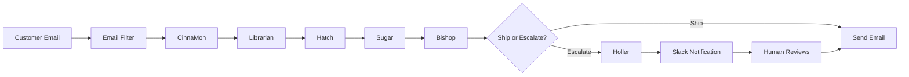

# What We're Building: AI-Powered Customer Service

**Session 1 | MindValley AI Mastery**

---

## The Big Picture

You're building an **AI-powered customer service email system** that can:

1. **Receive** a customer email
2. **Understand** what they need (sentiment, urgency, topic)
3. **Research** your knowledge base for relevant information
4. **Draft** a personalized response in your brand voice
5. **Quality check** before sending
6. **Ask you** when something needs human judgment

By the end of this course, you'll have a system that handles 80% of customer emails automatically while escalating the 20% that need your personal touch.

---

## Why This Matters

### The Problem
Customer service is expensive and inconsistent:
- Human agents cost $15-25/hour
- Response times vary (minutes to days)
- Quality depends on who's working
- Knowledge lives in scattered documents

### The Solution
AI agents working together:
- **Cost**: ~$0.03 per email (vs. $2-5 for human agent)
- **Speed**: Responses in seconds
- **Consistency**: Same quality every time
- **Knowledge**: Centralized, searchable, always available

### The Approach
You're not replacing humans. You're **augmenting** them:
- AI handles routine questions (hours, menu, policies)
- Humans handle edge cases (complaints, special requests)
- Every AI response gets human oversight before sending

---

## The 7-Agent Pipeline

Your system uses **7 specialized AI agents**, each with a single job:



### Meet the Team

Let's use **Hattie B's Hot Chicken** as our example. This Nashville restaurant receives hundreds of customer emails daily about heat levels, locations, wait times, and more.

---

#### 1. CinnaMon (Sentiment Analysis)

**Job**: Read the emotional temperature of incoming emails.

CinnaMon detects:
- **Emotion**: Is the customer happy, frustrated, neutral, or angry?
- **Urgency**: Do they need an immediate response?
- **Topics**: What are they asking about?

**Example**: A customer writes: "I've been waiting 45 minutes and still no food. This is ridiculous!"

CinnaMon flags this as:
- Emotion: **Frustrated/Angry**
- Urgency: **High**
- Topics: **Wait time, Service complaint**

This tells downstream agents to be empathetic, apologize, and prioritize resolution.

---

#### 2. Librarian (Knowledge Retrieval)

**Job**: Find relevant information from your knowledge base.

The Librarian searches your uploaded documents (FAQ, menu, policies, locations) and returns the most relevant excerpts. Using **Gemini File Search**, it:
- Understands the question semantically (not just keywords)
- Returns relevant passages with confidence scores
- Tells other agents when information is missing

**Example**: Customer asks about gluten-free options.

Librarian searches and returns:
- Menu items marked gluten-free
- Allergen policy statement
- Kitchen cross-contamination disclaimer

---

#### 3. Hatch (Expert Agent)

**Job**: Synthesize information and provide domain expertise.

Hatch is your company's subject matter expert. For Hattie B's, Hatch knows:
- Heat level recommendations based on spice tolerance
- Location-specific details (Nashville vs. Birmingham hours)
- When to recommend alternatives
- Company values and positioning

Hatch combines:
- Customer's question (from CinnaMon)
- Knowledge base results (from Librarian)
- **Current information via web search** (from Research tool)

**Tools Available**:
- Librarian (for KB lookups)
- Research Agent (for live web data like current wait times)

---

#### 4. Research Agent (Web Search Tool)

**Job**: Find current, real-time information from the web.

Some questions can't be answered from static documents:
- "What's the current wait time at the Birmingham location?"
- "Are you open on Thanksgiving?"
- "I saw on Instagram you have a new sauce?"

Research Agent uses web search to find:
- Current operating status
- Recent news or announcements
- Social media updates
- Competitor comparisons

**Note**: All agents know the current date and time, so they can verify whether information is still valid.

---

#### 5. Sugar (Email Drafter - "You've Got Mail")

**Job**: Write the customer response in your brand voice.

Sugar takes everything from the previous agents and crafts a response that sounds like **you**, not a robot. For Hattie B's, Sugar writes with:
- Southern hospitality warmth
- Pride in the heat levels (not apologetic)
- Helpful but not overly formal
- Real personality

**Example Output**:
> "Hey there! Thanks for reaching out about our heat levels. Here's how we do it at Hattie B's..."

Sugar drafts responses with Southern hospitality, addressing each of the customer's questions and matching the emotional tone detected by CinnaMon.

---

#### 6. Bishop (Quality Assurance)

**Job**: Evaluate the draft before it ships.

Bishop is your quality gate. Named after the Hattie B's family, Bishop evaluates:

| Criterion | Question |
|-----------|----------|
| Factual accuracy | Are all claims verifiable from KB or research? |
| Completeness | Did we answer every question? |
| Tone | Does this match the customer's emotional state? |
| Safety | Any allergen, legal, or PR risks? |
| Brand voice | Does this sound like Hattie B's? |

**Outputs**:
- **SHIP**: Response is good, send it
- **REVISE**: Needs minor fixes (loops back to Sugar)
- **ESCALATE**: Needs human judgment

---

#### 7. Holler (Human-in-the-Loop Briefer)

**Job**: Get human input when AI can't decide alone.

When Bishop escalates, Holler sends Tyler a Slack message with:
- The original customer email
- What CinnaMon detected
- What Sugar drafted
- Why Bishop is escalating

**Format**:
```
NEW HITL REQUEST

Customer: frustrated, asking about refund for cold food

Draft Response: [Sugar's attempt]

Escalation Reason: Refund request requires human approval

OPTIONS:
- Reply "ship" to send as-is
- Reply "revise: [your feedback]" for changes
- Reply "custom: [your response]" to replace entirely
```

The name "Holler" comes from the Nashville toast "Holler and Swaller" - it's calling out for help when needed.

---

## Two-Workflow Architecture

The system runs as **two separate N8N workflows**:

### Workflow 1: Email Processing Pipeline
Handles the automated processing:
```
Gmail Trigger → Filter → CinnaMon → Librarian → Hatch → Sugar → Bishop
```
- Runs automatically when email arrives
- No human interaction during processing
- Fast (~10-20 seconds per email)

### Workflow 2: Approval Handler
Handles the human-gated decisions:
```
Slack Trigger → Interpret Response → Route Decision → Send Email / Revise Draft
```
- Waits for human input
- Supports "ship", "revise", "custom" commands
- Loops back for revisions if needed

**Why two workflows?**
1. **Separation of concerns**: Processing is automated, approval is human-gated
2. **Reliability**: If Slack is down, processing still works
3. **Flexibility**: You can change approval flow without touching processing

---

## What You'll Customize

By the end of Session 3, you'll have personalized these three agents for your business:

### 1. Sugar (Your Brand Voice)
- Company personality and tone
- Email signature and formatting
- Industry-specific language

### 2. Hatch (Your Domain Expertise)
- Subject matter knowledge
- Product/service details
- Company policies and values

### 3. Holler (Your Notifications)
- Slack channel configuration
- Escalation triggers
- Response format preferences

---

## Technology Stack

| Component | Technology | Purpose |
|-----------|------------|---------|
| **Workflow Orchestration** | N8N Cloud | Connects everything together |
| **Knowledge Base** | Gemini File Search | Searchable document storage |
| **AI Processing** | Claude Sonnet | Agent reasoning and drafting |
| **Human-in-the-Loop** | Slack | Notifications and approvals |
| **Email** | Gmail | Trigger and send |
| **Data Logging** | Google Sheets | Audit trail and analytics |
| **AI Assistant** | Claude Code | Helps you configure everything |

---

## Why This Architecture?

### 1. Separation of Concerns
Each agent does **one thing well**. When something breaks, you know exactly where to look. When you want to improve sentiment detection, you only touch CinnaMon.

### 2. Different Models for Different Tasks
- CinnaMon uses fast, cheap models (classification doesn't need GPT-4)
- Sugar uses better models (drafting needs creativity)
- Librarian uses Gemini (required for File Search)

This **optimizes cost** without sacrificing quality.

### 3. Human Oversight at Key Points
Every email goes through Bishop (QA) before sending. Edge cases get human review via Holler. You maintain control while automating the routine.

### 4. Modular and Extensible
Want to add phone call handling? Add an agent. Want multi-language support? Add a translator before Sugar. The architecture grows with your needs.

---

## The Hattie B's Demo

Throughout this course, we'll use a complete implementation for **Hattie B's Hot Chicken** as our reference. This includes:

- All 7 agents configured and working
- Knowledge base with menu, locations, FAQ
- Sample customer emails for testing
- N8N workflows ready to import

You'll study how the Hattie B's system works, then replicate it for your own business.

---

## What's Next?

In today's session, you'll:

1. **Understand this architecture** (you just did!)
2. **Set up Gemini File Search** for your knowledge base
3. **Research and populate** your KB with business content
4. **Personalize system instructions** for Sugar, Hatch, and Holler

By the end of today, you'll have:
- Your knowledge base populated with your business content
- Personalized instructions for your three customizable agents
- A clear understanding of what you're building and why

---

## Questions to Consider

Before moving on, think about:

1. **What are your most common customer questions?** These become KB documents.
2. **What's your brand voice?** Formal? Casual? Friendly? Professional?
3. **What should ALWAYS escalate to a human?** Refunds? Complaints? Legal questions?
4. **What information changes frequently?** This needs the Research Agent, not static KB.

---

*Ready to build? Let's move to Gemini File Search setup.*
